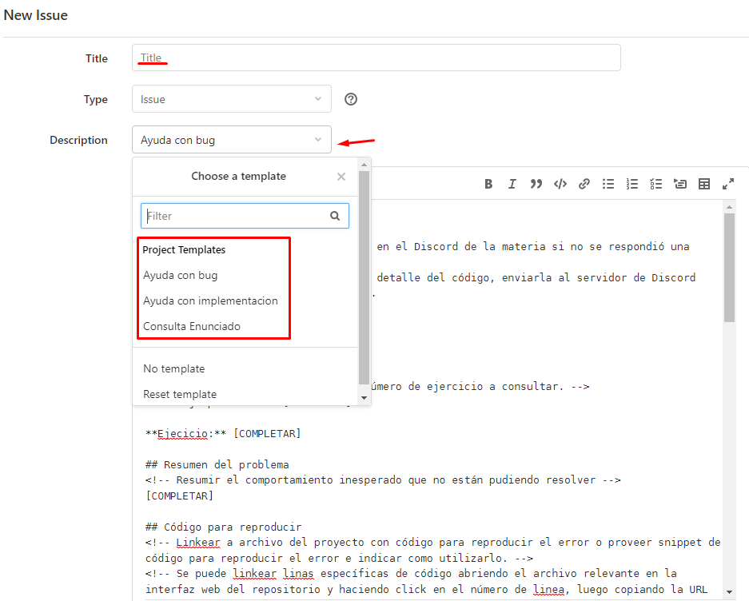

# Trabajo Práctico 0 - Git

**Fecha de entrega:** 22/08/2024

**Fecha de reentrega:** 05/09/2024

----

En este tp vamos a explorar brevemente el uso de **git**. 

**git** es una herramienta muy versátil y poderosa, que se puede adaptar a una gran cantidad de escenarios y flujos de trabajo.
Por esta razón, en una primera mirada nos puede parecer abrumador el número de comandos y variantes que brinda,
pero trataremos de restringirnos a los casos de uso más comunes y al _workflow_ que usaremos en la materia.

## Introducción

¿Qué es git? Citando a [su documentación](https://git-scm.com/):

> Git es un sistema de control de versiones gratuito y de código abierto, diseñado para manejar proyectos de cualquier tamaño de manera veloz y eficiente.
> ¿Qué es un control de versiones? Un control de versiones es un sistema que registra los cambios realizados en un archivo o conjunto de archivos a lo largo del tiempo, de modo que puedas recuperar versiones específicas más adelante.

> La principal diferencia entre Git y cualquier otro VCS es la forma en la que manejan sus datos. Conceptualmente, la mayoría de los otros sistemas almacenan la información como una lista de cambios en los archivos.
> Git maneja sus datos como un conjunto de copias instantáneas de un sistema de archivos miniatura. Cada vez que confirmas un cambio, o guardas el estado de tu proyecto en Git, él básicamente toma una foto del aspecto de todos tus archivos en ese momento y guarda una referencia a esa copia instantánea. Para ser eficiente, si los archivos no se han modificado Git no almacena el archivo de nuevo, sino un enlace al archivo anterior idéntico que ya tiene almacenado. 

> La mayoría de las operaciones en Git sólo necesitan archivos y recursos locales para funcionar. Por ejemplo, (...) si quieres ver los cambios introducidos en un archivo entre la versión actual y la de hace un mes, Git puede buscar el archivo de hace un mes y hacer un cálculo de diferencias localmente, en lugar de tener que pedirle a un servidor remoto que lo haga, u obtener una versión antigua desde la red y hacerlo de manera local. 
> Esto significa que hay muy poco que no puedes hacer si estás desconectado o sin VPN. Si te subes a un avión o a un tren y quieres trabajar un poco, puedes confirmar tus cambios felizmente hasta que consigas una conexión de red para subirlos. 

Debido a su popularidad, se dispone de una cantidad enorme de tutoriales y guías de uso. Recomendamos algunas que nos parecieron interesantes en la sección [Referencias](#ref).

Supondremos a lo largo del taller una instalación de Linux, de tipo Ubuntu/Debian. Si instalaste alguna distribución basado en otro sistema (Arch, Fedora), entonces entendemos que _sabes de qué va la cosa_. Si sos usuario/a de Windows, existe una herramienta llamada WSL que nos permite contar con una instalación y consola de Linux que pueden utilizar para los trabajos de la materia, les dejamos un link con instrucciones básicas de instalación y uso: https://learn.microsoft.com/es-es/windows/wsl/install

El listado de temas que vamos a explorar abarca los siguientes:

- [Instalación y configuración](#installation)
- [Forkeando el repo](#forking)
- [Clonando el repo](#cloning)
- [Aplicar cambios locales al repositorio remoto](#push)
- [Referencias](#ref)

<h2 id="installation">Instalación y configuración</h2>

Para instalar **git** en una distribución Debian/Ubuntu simplemente debemos hacer:

```shell
$ sudo apt install git
```

Podemos comprobar que ha sido instalado correctamente, haciendo

```shell
$ git --version
```

En cuanto a la configuración, debemos indicarle a git nuestro nombre y mail para que pueda firmar los commits
cada vez que hagamos uno.

```shell
$ git config --global user.name <su nombre>
$ git config --global user.email <su email>
```

Pasando el parámetro `--global` aplicamos la configuración para nuestro usuario, con lo cual quedará configurado con estos parámetros para todos los repos nuevos que creemos.

<h2 id="forking">Forkeando el repo</h2>

Vamos a darles dos repos con los con los enunciados y los archivos necesarios para el desarrollo de las actividades. Un repositorio destinado a trabajos individuales y parciales, este que están viendo ahora, y otro para los trabajos prácticos grupales. La idea es que ustedes hagan copias propias de estos repositorios sobre las que puedan trabajar libremente, a eso le llamamos "hacer un fork" del repositorio original. Luego, a medida que vayamos publicando TPs/parciales, les iremos avisando para que actualicen sus repositorios con lo publicado en dichos repositorios originales.

En principio, para hacer un fork: 

1. Presionamos el botón que se indica en la siguiente imagen:


2. Seleccionamos el _namespace_ al que pertenecerá el proyecto (a criterio de ustedes) y esperamos a que finalice, luego de lo cual ya tienen su propio repositorio sobre el cual trabajar.

3. :exclamation: <ins>Revisamos que el nuevo repositorio sea **privado**</ins>


4. :exclamation: <ins>Y añadimos a todos los docentes como miembros con rol **Developer**</ins>


Los usuarios a agregar son:

- emarchi
- bventrici
- fdemartino
- gzuker
- iglosiggio
- imaqueda
- jszabo
- mpiaggio
- mcervetto
- nromero
- sruberto
- afernandezortuzar
- kgoldsmit

5. Una vez agregados los docentes, consultamos con el siguiente comando al OrgaBot en Discord para asegurarnos de que los docentes tienen acceso a nuestro repo y que todo fue configurado todo correctamente.


> :warning: De no configurar el repositorio como privado y agregar a todos los docentes como **developers**, no podremos responder sus consultas ni registrar sus entregas como válidas

<h2 id="cloning">Clonando el repo</h2>

Para continuar, si todavía no lo hicieron, es necesario que clonen el repositorio actual a su PC. De esta manera, podrán trabajar localmente sobre el repositorio e ir enviando los cambios al repositorio remoto (en este caso alojado en **git.exactas.uba.ar**), a medida que lo crean necesario.

Hay tres formas de clonar un repositorio:

- Utilizando la url que comienza con *https://git.exactas.uba.ar/*
- Por SSH
- Por Github CLI

Si clonamos utilizando la primera opción, tendremos que autenticarnos con usuario y contraseña cada vez que hagamos alguna operación con el servidor remoto desde nuestra PC. Esto se torna molesto rápidamente. Nuestras recomendaciones son las siguientes:

- **En su computadora personal**, configurar un acceso por _SSH_ que creemos es lo más sencillo y cómodo (existen otras opciones como configurar un administrador de credenciales). Para configurar una clave ssh pueden seguir los pasos que están en el siguiente [link](https://git.exactas.uba.ar/help/ssh/README). Los pasos claves son "Generate an SSH key pair" y "Add an SSH key to your GitLab account". 
- **En las computadoras de los laboratorios**, donde varias personas utilizan el mismo usuario y posiblemente ustedes cambien de computadoras entre clases, recomendamos configurar acceso mediante HTTPS. Si realmente desean utilizar SSH es posible [configurar múltiples claves](https://stackoverflow.com/questions/2419566/best-way-to-use-multiple-ssh-private-keys-on-one-client/38454037#38454037) para el mismo sitio, pero tengan en cuenta que tendrán que hacerlo en cada computadora que quieran usar, y que deben asociar una contraseña a la clave para evitar que otros usuarios realicen operaciones en su nombre.

Una vez configurada nuestra clave ssh (se puede [probar](https://git.exactas.uba.ar/help/ssh/README#verify-that-you-can-connect)!) vamos a usar la dirección del dropdown `clone` que comienza con **git@git.exactas.uba.ar** para clonar el repositorio:


Por ejemplo para clonar el repo con dirección SSH: **git@git.exactas.uba.ar:ejemplo/individual-2c2024.git**, hacemos `cd` al directorio en el cual querramos guardar el repositorio en nuestro filesystem y ejecutamos

```shell
$ git clone git@git.exactas.uba.ar:ejemplo/individual-2c2024.git
```

De elegir usar HTTPS, corremos el mismo comando reemplazando la dirección ssh por la dirección HTTPS del dropdown `clone` (en este caso sería `https://git.exactas.uba.ar/ejemplo/individual-2c2024.git`).

Si todo salió bien, deberíamos ver algo parecido a lo siguiente:

```shell
Cloning into 'individual-2c2024'...
remote: Enumerating objects: 24, done.
remote: Counting objects: 100% (24/24), done.
remote: Compressing objects: 100% (19/19), done.
remote: Total 24 (delta 0), reused 24 (delta 0), pack-reused 0
Receiving objects: 100% (24/24), 303.16 KiB | 192.00 KiB/s, done.
```

y aparecerá un subdirectorio **individual-2c2024**.

Les recomendamos usar el editor de texto VSCode [vscode](https://code.visualstudio.com/) en el que pueden descargar las siguientes dos extensiones que son utiles para manejar repositorios de git:

[gitlens](https://marketplace.visualstudio.com/items?itemName=eamodio.gitlens)
[git-graph](https://marketplace.visualstudio.com/items?itemName=mhutchie.git-graph)

Pueden instalarlas de dos maneras:

1. Desde el marketplace
2. Haciendo Ctrl + P (Quick Open) y luego:

```shell
ext install mhutchie.git-graph
ext install eamodio.gitlens
```

Para acceder al gráfico de git:


<h3 id="push">Aplicar cambios locales al repositorio remoto</h3>

Cualquier modificación que realicemos en el directorio solo afectará el estado del repositorio local (que se encuentra alojado en el directorio oculto **.git**). Cuando estemos listos para reflejar los cambios en el servidor remoto, realizaremos una serie de pasos:

- :pen_fountain: **Completen con sus datos el archivo datos_estudiante.txt** así tenemos una modificación para versionar.

En primer lugar debemos seleccionar los archivos modificados/agregados que pretendemos subir. Se pueden seleccionar todos clickeando en el botón que indica la imagen, o seleccionar manualmente cada uno utilizando los botones `+` individuales a la derecha de cada archivo. En su caso el único archivo a versionar será datos_estudiante.txt


Luego debemos realizar un _commit_ de los cambios realizados desde la última versión guardada del repositorio (el _commit_ anterior). Todo _commit_ tiene asociado un _mensaje_ que describe brevemente las modificaciones que están siendo aplicadas. En este caso elegimos el mensaje `"datos completados"`.


Escrito el mensaje, podemos **apretar el símbolo de tilde** :white_check_mark: para grabar el _commit_.

Así nuestros cambios han sido registrados en un commit *local* pero aún no se han aplicado en el repositorio _remoto_. 
Se pueden realizar múltiples commits locales si se quieren ir estableciendo puntos en los que el desarrollo es estable antes de seguir avanzando (esto también facilita que los mensajes de commit sean descriptivos), de forma que si algún cambio introduce errores sea fácil deshacerlo (git provee herramientas para comparar y deshacer commits, entre muchas otras operaciones).

Finalmente hay que realizar un `push` para que **todos los commits locales pendientes impacten en el repositorio remoto**.


Todos estos pasos pueden realizarse desde la consola de comandos en lugar de la GUI de VSCode, siéntanse libres de utilizar el método que les resulte más cómodo.

Procuren siempre realizar un `pull` del repositorio antes de sentarse a trabajar, de ese modo **el repositorio local se actualizará con las modificaciones que haya en el remoto**. De todos modos, si alguien más realizó un push al repositorio remoto luego de la última vez que hicieron pull, es posible que aparezcan conflictos entre los cambios remotos y sus cambios locales. En la próxima sección dejamos algunas referencias de material complementario para que puedan profundizar cuando lo necesiten.

<h2 id="ref">Referencias</h3>

- [El tutorial de atlassian, que es excelente](https://www.atlassian.com/es/git/tutorials)
- [EL libro](https://git-scm.com/book/es/v2)
- [git guide](http://rogerdudler.github.io/git-guide/)
- [Demo interactiva](https://learngitbranching.js.org/)
- [Otra demo interactiva](https://onlywei.github.io/explain-git-with-d3/)


## Como hacer consultas de TP

Durante la cursada, manejaremos las consultas que sean específicas de un tp y su implementación mediante issues de gitlab. 
Para ello vamos a utilizar templates predefinidos que nos van a ayudar a organizarnos. 
Es importante que usen y respeten el **esquema de los templates**, están diseñados para que los docentes tardemos el menor tiempo posible en identificar el problema y ayudarlos. 
Idealmente, muchas de sus dudas las van a resolver por su cuenta en el proceso de definir bien la consulta.

1. **En su propio fork** del repositorio del TP navegar a la sección `Issues`
2. Presionar el botón `New issue`


3. Completar un título, elegir el type "issue"
4. En el campo `description` **elegir el template correspondiente** al tipo de consulta a realizar
   > :warning: Issues que no respeten alguno de los formatos de template dados no serán respondidas
   >
   > Completar los campos marcados con `[COMPLETAR]`



5. Una vez completado el template utilizar el botón `preview` para revisar que la consulta se esté generando correctamente.
   > :warning: Pueden encontrar una consulta de ejemplo en https://gitlab.exactas.uba.ar/ayoc-doc/individual-2c2024/-/issues/1
6. Opcionalmente, pueden asignarle a la issue una `Label` con el mismo nombre que el template elegido. Deberán crear la project label correspondiente.
7. Presionar botón `Create issue`


## Snippets

Para evitar pegar enormes logs de debuggeo en la issue, que dificultarían su lectura, vamos a compartir los logs como archivos separados mediante *snippets* de Gitlab.
Un _snippet_ funciona como un pequeño repositorio con funcionalidad mínima para pocos archivos sueltos, con _syntax highlighting_.
Está pensado para compartir código rápidamente sin necesidad de crear un repositorio completo nuevo.

> :warning: Pueden encontrar un snippet de ejemplo en la consulta de ejemplo de https://gitlab.exactas.uba.ar/ayoc-doc/individual-2c2024/-/issues/1

Para compartir logs o código mediante snippets:
1. Presionar el botón `+` al costado de la barra de búsqueda superior
2. Seleccionar la opción `new snippet`
    
3. Completar título y contenido del snippet, presionando el botón `Add another file` si queremos agregar más de un archivo
    
4. Elegir el nivel de visibilidad `internal` (de elegir privado nadie más podrá ver el snippet, ya que no hay control granular sobre snippets)
5. Presionar el botón `Create snippet`
    

## Un poco de C

Vamos a hacer uso de algunos de los conceptos vistos durante esta primer clase. En la carpeta _src_ van a encontrar unos cuantos archivos:

- `ej1.h`: contiene las declaraciones de variables y funciones a ser definidas en ej1.c.
- `ej1.c`: contiene las definiciones de las variables y funciones declaradas en ej1.h, algunas de las cuales deberán completar (ver enunciado más adelante).
- `main.c`: acá pueden definir sus propias pruebas, recuerden que todo programa en C comienza su ejecución llamando a la funcion _main_.
- `test.c`: contiene un caso de prueba. No se supone que lo modifiquen, pueden inspirarse en sus contenidos para realizar sus propias pruebas.
- `Makefile`: contiene las definiciones de **comandos de compilación**, para no tener que escribir el comando completo cada vez que se quiera compilar. Se invocan escribiendo **make** seguido de la etiqueta correspondiente (ej: `make all`, `make main`, `make test`).
- `runMain.sh`: script que compila y corre con valgrind su solución a partir de main.c.
- `runTester.sh` script que compila y corre con valgrind su solución a partir de test.c, comparando la salida producida con la salida esperada.
- `salida.catedra.txt`: archivo de salida generado por nuestra solución, contra el que se comparará el archivo que genere su solución al correr el archivo runTester.sh.

## Enunciado

OrgaLibre es una tienda online de componentes de PC que vende a precios muy bajos. Como quieren asegurarse de que sus clientes les vayan a dar buen uso a lo que compren, envían el catálogo de productos de una forma muy particular.

El catálogo se representa como un array de enteros de 32 bits donde cada par de elementos consecutivos almacena los datos de dos productos distintos de la siguiente forma:


Entero 1: ID1 (8 bits), ID2 (8 bits), Precio1 (12 bits), Moneda1 (1 bit), Precio2 (bits 11 a 9)

Entero 2: Precio2 (bits 8 a 0), Moneda2 (1 bit), Stock1 (11 bits), Stock2 (11 bits)

Se pide:
1. Implementar las funciones `imprimir_producto` y `procesar_e_imprimir_catalogo` para ayudar a leer el catálogo cómodamente. Sus definiciones y detalles los van a encontrar en `ej1.h`
2. Una vez que finalicen la implementación, pushearla a su repo y **abrir un issue** con el template "Ayuda con bug". Incluir en la sección "Salida de tests" un link a un snippet con la salida por consola de `runTester.sh`. 
3. Completar este [formulario](https://docs.google.com/forms/d/e/1FAIpQLSe0It9atI0WyikeAlsbo6crDyVSh18cCNoo8m0aAUQ8Q0ws3w/viewform?usp=sf_link) para informar el repositorio individual y registrar la entrega del tp.


